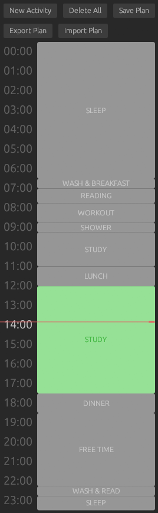

# DailyPlanner

**DailyPlanner** is a Rust-based desktop application designed to help users maintain and organize a daily routine. The user can create, edit, and delete daily activities, and the application will notify the user when an activity starts and ends. The user can also save so it can be automatically loaded on startup, and import and export the schedule to and from a file. The app can be minimized, otherwise it will always be on top of other windows.



## Features

- **Schedule Management**: Create, edit, and delete daily activities.
- **Save and Auto-Load**: Save your schedule and automatically load it on startup.
- **Import and Export**: Import and export your schedule to and from a file.
- **Notifications**: Get notified when a new activity starts and when an activity ends.

## Installation

1. Clone the repository:
    ```sh
    git clone https://github.com/claudekoo/daily_planner.git
    ```
2. Navigate to the project directory:
    ```sh
    cd daily_planner
    ```
3. Build the application:
    ```sh
    cargo build --release
    ```
4. Run the application:
    ```sh
    cargo run
    ```
